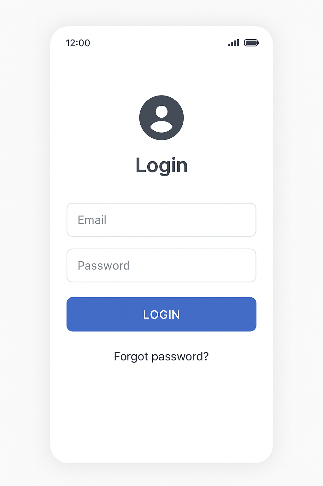
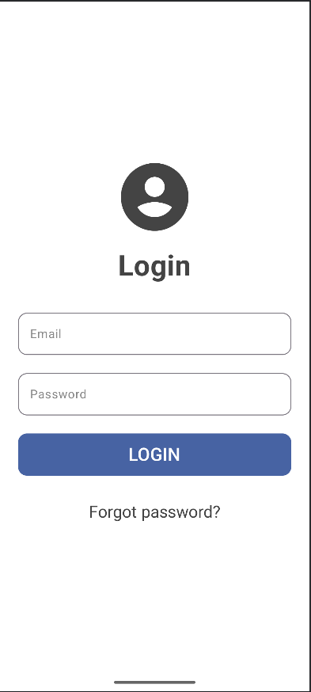

🎨 UI do odtworzenia

🎯 Cel

Zbudować prosty ekran logowania korzystając z podstawowych komponentów Compose.

💡 Warto użyć

Column, Spacer, Box, Icon, Text, OutlinedTextField, Button, TextButton,

👉 Moje rozwiązanie

