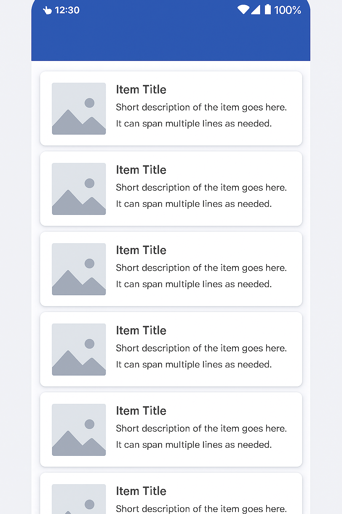
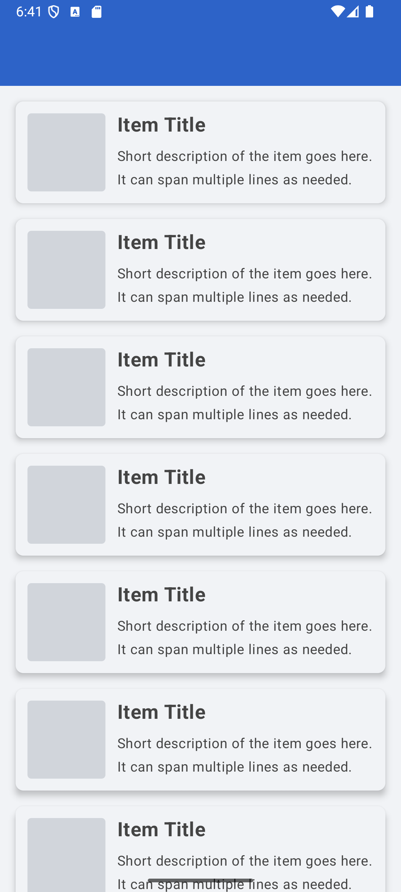

🎨 UI do odtworzenia

🎯 Cel

Stworzyć ekran przedstawiający listę elementów (kart), każdy z obrazkiem, tytułem i opisem.

💡 Warto użyć

Column, Box, LazyColumn, Card, Row,  Box, Spacer, Text 

👉 Moje rozwiązanie 

