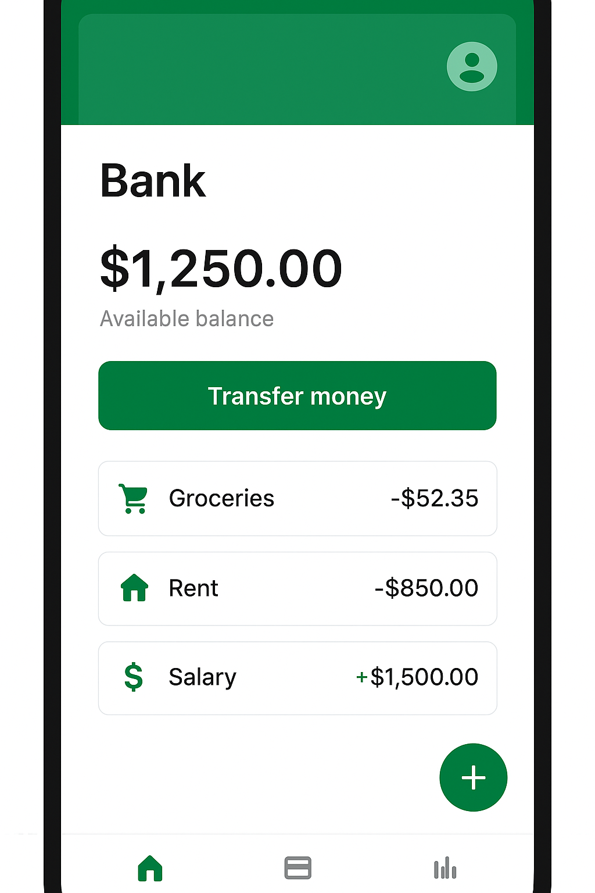
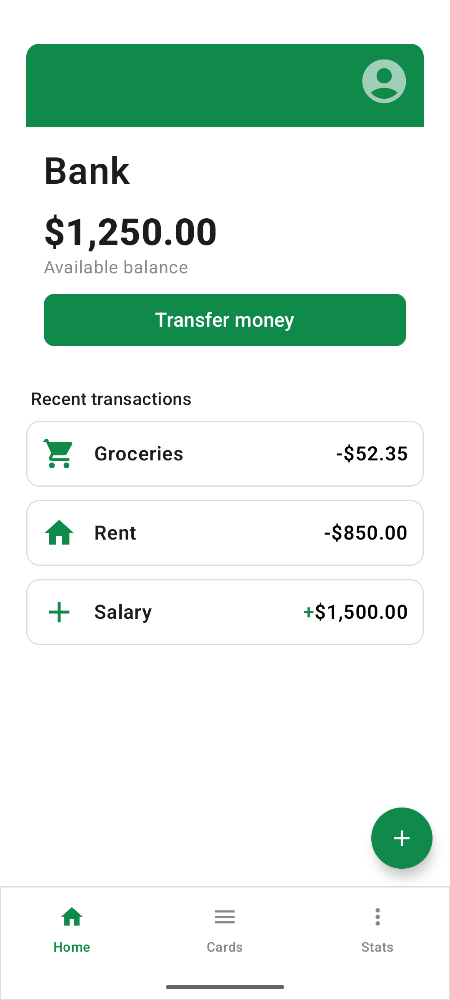

🎨 UI do odtworzenia

🎯 Cel

Stworzyć ekran "home" przykładowej aplikacji bankowej

💡 Warto użyć

Scaffold(bottomBar, floatingActionButton), Column, Box, Icon, Card, Row, Spacer, Text 

👉 Moje rozwiązanie 

